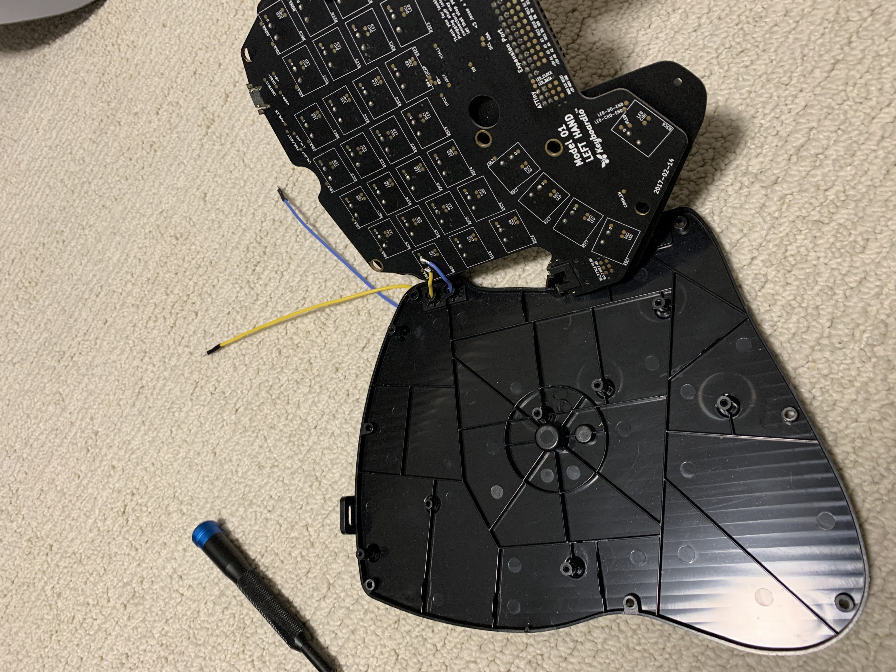
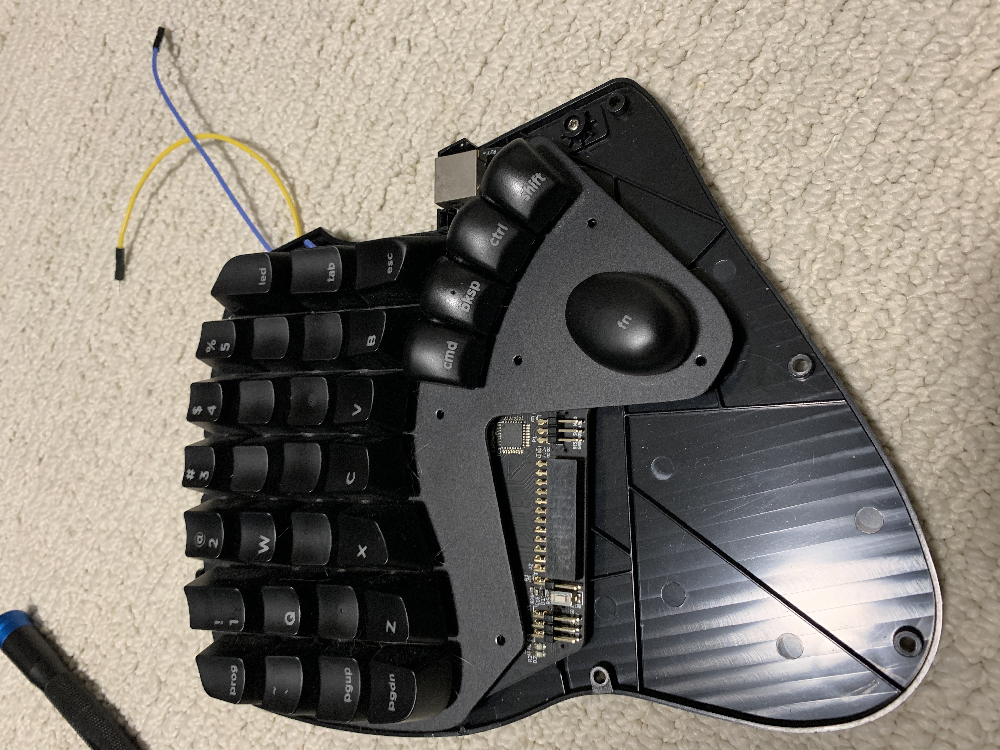
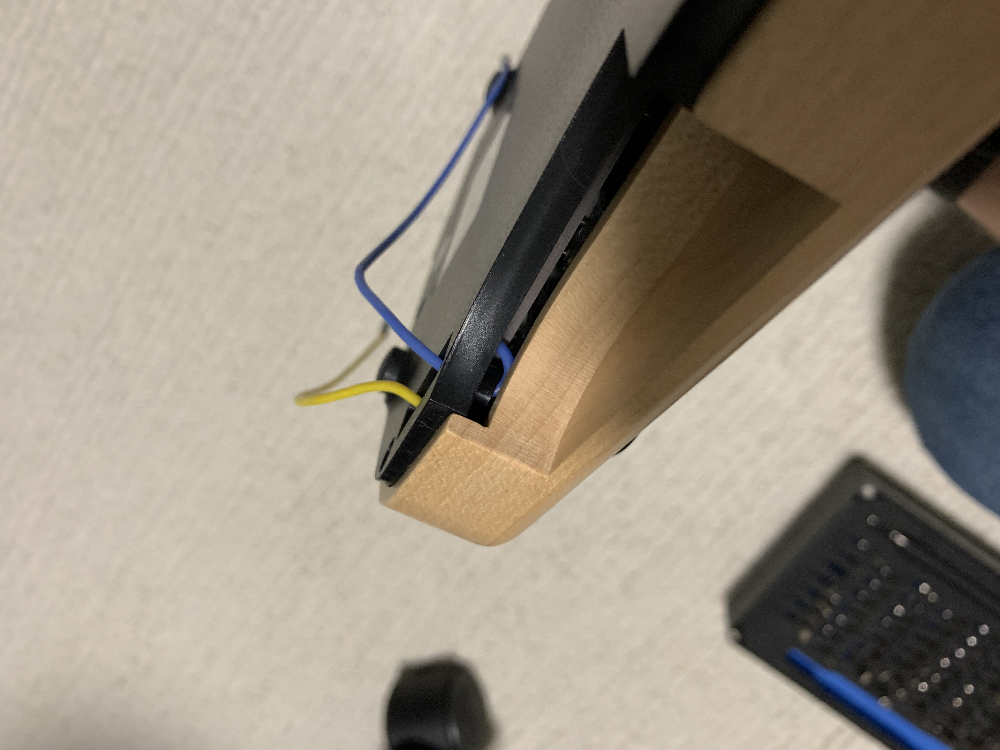

# trackball-proximity
Press a keyboard key when your hand is on a trackball

Here is a demo: https://twitter.com/tannewt/status/1359937799173021699

The sensor is a [VCNL4040](https://www.adafruit.com/product/4161) and a [Feather M0 Express](https://www.adafruit.com/product/3403) (though a [QT Py](https://www.adafruit.com/product/4600) would be more compact.)

The `code.py` sets D13 to high when the proximity is met. This connects to a [SN74LVC1G3157DBVR](https://www.digikey.com/en/products/detail/SN74LVC1G3157DBVR/296-14908-1-ND/562548) which is an analog mux. It effectively "presses" the LED key switch for me. The Yellow and Blue wires from the keyboard are soldered to the solder joints for the LED key switch.

The keyboard is then configured via Chrysalis to have a layer when the LED key is pressed. This is the mouse layer and includes mouse clicks and such on the right hand. (Next LED is now Fn-LED for me.)
